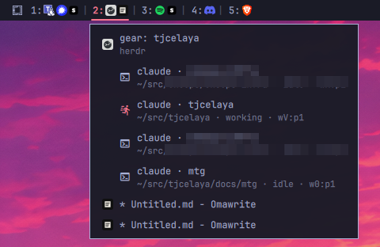

# omarchy-workspace-icons

An omarchy-shell bar widget (`tjcelaya.workspace-icons`) that replaces the stock workspace
switcher. Each workspace shows its number followed by the icons of the apps open on it:

```
1: [herdr] | 2: [omawrite] [discord] [signal] [terminal] | 3: [discord] | 4: [spotify] [brave] | 5: | 7: [brave]
```



- The focused workspace's number is highlighted and underlined; empty workspaces are dimmed.
- Click a workspace to focus it.
- Hover a workspace for a panel listing its windows; click a row to focus that window.
- Workspaces 1–5 are always shown; others appear while they have windows.

## Coding agents (optional)

If [modelctl](https://github.com/tjcelaya/omarchy-modelctl) is installed, the hover panel
also lists the coding agents running inside each terminal (herdr panes, or a plain terminal
running claude/opencode/codex…) with their directory and status, and clicking an agent row
jumps straight to its pane. In the bar, every terminal hosting agents wears one shared
agent-host icon (`agentIcon`, default the bundled herdr logo) whether the agents run under herdr,
tmux, or directly; otherwise the bar stays as it is, one icon per window.

This is a soft link, not a dependency. The helper runs `modelctl-agents` when it finds it on
`PATH` or in `~/.config/omarchy/plugins/tjcelaya.modelctl/bin/`; without it the panel simply
shows windows only. Neither plugin needs the other installed.

## Where icons come from

`bin/wsicons-state` reads `hyprctl clients -j` and picks an icon name for each window from the
same desktop entries the Omarchy launcher uses:

1. **Omarchy webapps** (`omarchy-launch-webapp <url>` entries): the Chromium `--app` window class
   (e.g. `brave-discord.com__channels_@me-Default`) is matched back to its entry's `Icon=`.
2. **Other apps**: `StartupWMClass`, then desktop-file id, then `Exec` binary.
3. **Terminals** (classes listed in `terminalClasses`): the process tree under the terminal is
   walked breadth first, skipping shells, and the outermost program found (e.g. `herdr`, `nvim`)
   gets an icon from `programIcons`, an icon bundled in `icons/` (herdr's logo ships there, see
   `NOTICE.md`), a desktop entry of the same name, or a built-in Nerd Font glyph. A terminal with only a shell in it shows the terminal's own icon.

The widget turns icon names into images with Quickshell's themed icon lookup, falling back to
`DesktopEntries.heuristicLookup` and then `application-x-executable`. It refreshes on Hyprland
window events, and every `pollSec` seconds to notice programs starting inside terminals.

Terminals running in server mode (`foot --server` + `footclient`) share one process, so every
client window reports the same program.

## Install

From the marketplace or straight from GitHub:

```bash
omarchy plugin add https://github.com/tjcelaya/omarchy-workspace-icons.git --enable
omarchy plugin disable omarchy.workspaces   # optional: drop the stock switcher
```

`omarchy plugin add` places the widget in the bar's left section. Move it next to the menu
button with `omarchy bar move tjcelaya.workspace-icons --after omarchy.menu`.

From a checkout (development):

```bash
./install.sh     # symlink into ~/.config/omarchy/plugins, swap in for omarchy.workspaces
./uninstall.sh   # restore omarchy.workspaces and unlink
```

## Remove

```bash
omarchy plugin remove tjcelaya.workspace-icons
omarchy plugin enable omarchy.workspaces
```

Or `./uninstall.sh` for a symlinked checkout. Nothing else is written outside
`~/.config/omarchy/plugins/`; the only user-config change is the bar layout entry in
`~/.config/omarchy/shell.json`, made through `omarchy plugin` / `omarchy bar`.

## Dependencies

All present on a stock Omarchy install: `python3` (standard library only), `hyprctl`,
`jq` (used by `install.sh`), and a Nerd Font for the terminal-program glyphs. The helper
reads `/proc/*/stat` to find what runs inside terminals; it never writes anywhere.
Optional: `tjcelaya.modelctl` for the agent rows described above.

The plugin directory is a symlink to this checkout. The shell caches compiled QML, so after
editing `Workspaces.qml` run `omarchy-restart-shell` to see the change; edits to
`bin/wsicons-state` take effect on its next run.

## Settings

Set with `omarchy bar set tjcelaya.workspace-icons <key> <value>`:

| key | default | meaning |
|---|---|---|
| `persistentWorkspaces` | `1-5` | always-shown workspaces (`1-5`, `1,2,3`) |
| `separator` | `\|` | text between workspaces; empty for none |
| `dedupe` | `true` | one icon per app per workspace |
| `pollSec` | `3` | terminal re-check interval |
| `iconSize` | `14` | icon size in px |
| `terminalClasses` | `foot,footclient,Alacritty,kitty,com.mitchellh.ghostty` | window classes treated as terminals |
| `agentIcon` | `herdr` | icon for any terminal hosting agent sessions (herdr, tmux, or a bare agent): a program name, a glyph, or empty to keep the per-program icon |
| `programIcons` | empty | `program=icon-name` or `program=glyph`, comma separated, e.g. `herdr=utilities-terminal,btop=󰍛` |

Check what the helper sees with `bin/wsicons-state | jq`.

## License

MIT.
